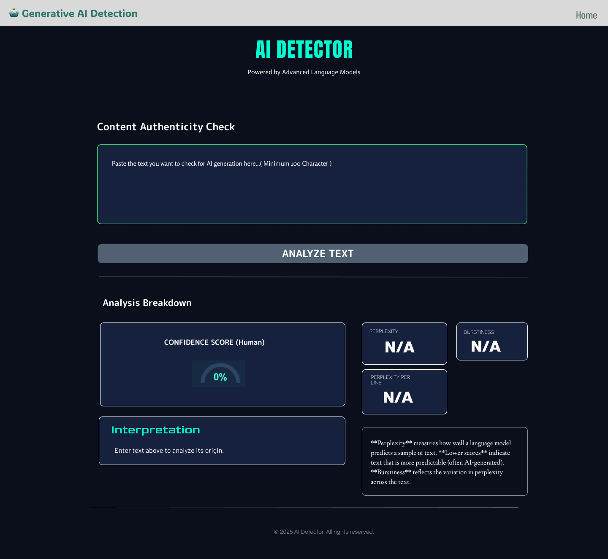
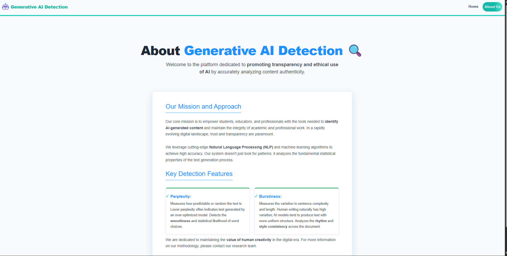
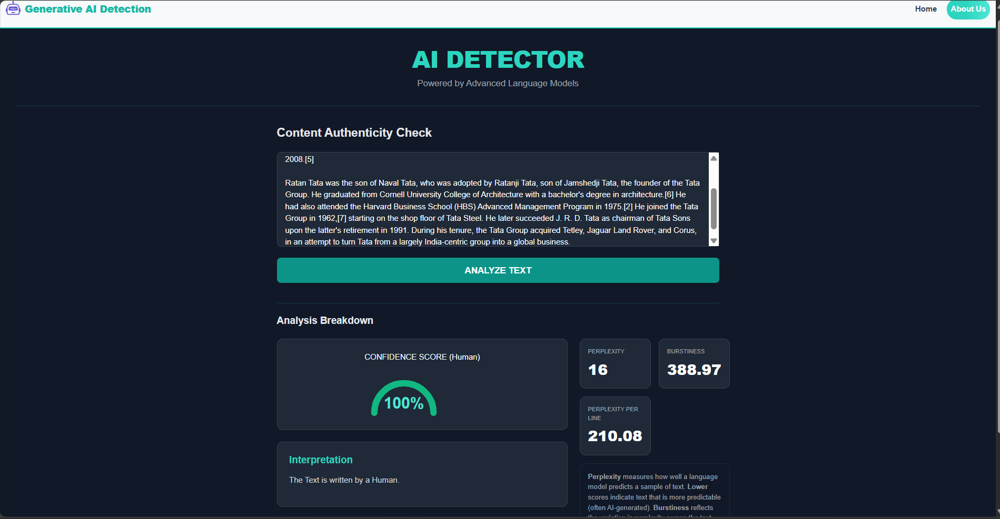
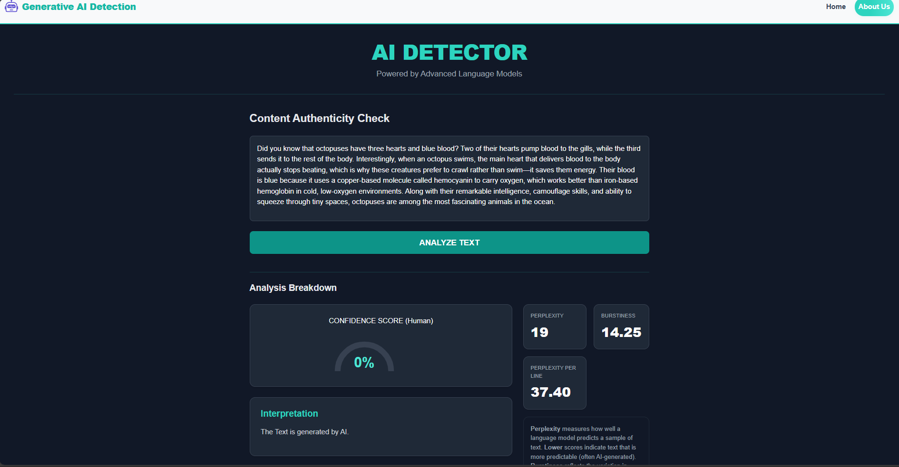

# 🤖 Generative AI Detection

A modern **AI Content Detection** web application that identifies whether a given text is generated by **AI models** or written by **humans**.  
This project uses **React.js** for the frontend and **Flask (Python)** for the backend to deliver accurate, real-time results with a clean, interactive UI.

---

## 🌟 Features

### 🧠 AI Content Detection
- Paste or upload text to detect whether it’s **AI-generated** or **human-written**.
- Displays a **confidence percentage** (e.g., 85% AI-generated).
- Provides a detailed explanation of the detection result.

### 📊 Visualization
- Graphical output or probability bars showing AI vs Human likelihood.
- Clean and interactive cards with detection summaries.

### 🌐 User Interface
- Built using **React.js** and **Tailwind CSS**.
- Responsive and minimal design optimized for both desktop and mobile.

### 🔧 Backend Processing
- Flask-based backend to process text data.
- Integrates with pretrained AI-detection models or API endpoints.

### 📁 Additional Pages
- **Home Page:** Main detection interface.
- **About Us:** Explains model working and project overview.
- **Footer & Navbar Components:** For consistent layout across the app.

---

## 🏗️ Tech Stack

### Frontend
- ⚛️ React.js  
- 🎨 Tailwind CSS  
- 🧩 JSX Components

### Backend
- 🐍 Python  
- 🚀 Flask Framework  

### Tools & Libraries
- `axios` for API communication  
- `react-icons` for UI icons  
- `flask-cors` for cross-origin resource sharing  
- `numpy`, `scikit-learn`, or `transformers` (depending on AI model used)

---

## 📁 Project Structure
```
📦 GENERATIVE-AI-DETECTION
├── 📁 .vscode
│ └── settings.json
├──  📁 screenshots
│   ├── 🖼️ HomePage.png
│   ├── 🖼️ aboutUs.png
│   ├── 🖼️ AI-text-output.png
│   └── 🖼️ Human-text-output.png
├── 🖼️ HomePage.jpg
├── 📁 node_modules
├── 📁 public
│ └── index.html
├── 📁 server
│ └── (Flask backend files)
├── 🐍 app.py # Flask backend entry point
├── 📁 src
│ ├── 📁 Components
│ │ ├── AboutUs.jsx
│ │ ├── CardBody.jsx
│ │ ├── Footer.jsx
│ │ ├── Navbar.jsx
│ ├── 📄 App.css
│ ├── 📄 App.js
│ ├── 📄 index.css
│ ├── 📄 index.js
│ ├── 📄 logo.svg
│ ├── 📄 reportWebVitals.js
│ └── 📄 setupTests.js
├── ⚙️ .gitignore
├── 🧩 package.json
├── 🧩 package-lock.json
└── 📝 README.md
```

---

## 🚀 Getting Started

### Prerequisites
- Node.js (v18+ recommended)
- Python (v3.9+)
- Flask installed (`pip install flask flask-cors`)
- React dependencies (`npm install`)

---

### 🧩 Installation

1. Clone the repository:
```bash
git clone https://github.com/Adityasaw8180/AI-Content-Detector.git
```
2. Navigate into the project directory:
```bash
cd Generative-AI-Detection
```
3. Install dependencies:
```bash
npm install
```
4. Run Flask backend:
```bash
cd server
python app.py
```
5. Run the app:
```bash
npm start
```
6. Open your browser at:
```bash
http://localhost:3000
```
### 🖼️ Screenshots

#### Home Page


#### About Us Page


#### Human Content detection


#### AI Content detection


#### Figma link
```bash
https://www.figma.com/design/1IpFREB31q1n63wgCdjSez/Ai-content-detector?node-id=0-1&p=f&m=draw
```
